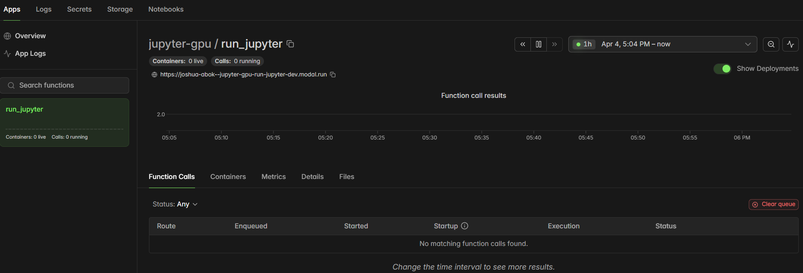

# 🚀 Modal Jupyter GPU Setup

This module launches a **Jupyter Lab environment on Modal** with optional GPU support, designed for interactive research and heavy data workflows (e.g. market microstructure analysis).

---

# 📁 File

```
modaL_jupyter.py
```

---

# ⚙️ What It Does

* Spins up a remote Jupyter Lab instance
* Runs inside a containerized environment
* Installs core data science dependencies:

  * pandas
  * numpy
  * pyarrow
  * plotly
  * scikit-learn
  * hdbscan
* Serves Jupyter via a **public Modal URL**
* Runs for up to **24 hours**

---

# 🧰 Requirements

* Python 3.9+
* Modal CLI installed:

```bash
pip install modal
modal setup
```

---

# 🚀 Run (Development Mode)

```bash
modal serve modaL_jupyter.py
```

---

## 🔗 Output

After running, you’ll get a URL like:

```
https://your-app.modal.run
```

👉 Open it in your browser to access Jupyter Lab.

---

Here’s an example of modal interface when running the file `modaL_jupyter.py`:



---

# 🔄 Redeploy (Update Code)

Whenever you make changes:

```bash
modal serve modaL_jupyter.py
```

👉 This automatically:

* rebuilds the environment (if needed)
* updates your running app
* replaces the previous version

---

# 🧠 Important Notes

## 1. No manual restart needed

* Modal handles container lifecycle
* Old instances shut down automatically

---

## 2. Code changes

| Change type  | Behavior             |
| ------------ | -------------------- |
| Python logic | Fast reload ⚡        |
| Dependencies | Rebuild container 🐢 |

---

## 3. Working directory

The app runs from:

```bash
/root/market_microstructure_manipulation
```

Make sure your project exists there inside the container.

---

# 🔐 Private Repo Access (Optional)

To clone private repos securely:

```bash
modal secret create github-token GITHUB_TOKEN=your_token_here
```

Then enable in code:

```python
@app.function(secrets=[modal.Secret.from_name("github-token")])
```

---

# ⚡ GPU Support (Optional)

Enable GPU by uncommenting:

```python
gpu="any"  # or "A10G", "T4"
```

---

# 🧪 Customization

### Add more packages

```python
.pip_install("torch", "xgboost", "lightgbm")
```

---

### Auto-open specific notebook

Modify:

```python
"jupyter", "lab", "path/to/notebook.ipynb"
```

---

# 🧠 Workflow

1. Edit code locally
2. Run:

```bash
modal serve modaL_jupyter.py
```

3. Open URL
4. Work in Jupyter
5. Repeat

---

# ⚠️ Common Issues

### ❌ “This site can’t be reached”

* Don’t use `localhost` or `modal:8888`
* Always use the Modal-provided URL

---

### ❌ Notebook not updating

* Restart kernel in Jupyter
* Or redeploy app

---

# ✔️ Summary

* ✅ One command to launch Jupyter on GPU
* ✅ No port forwarding required
* ✅ Fully remote, browser-accessible
* ✅ Easy redeploy workflow


