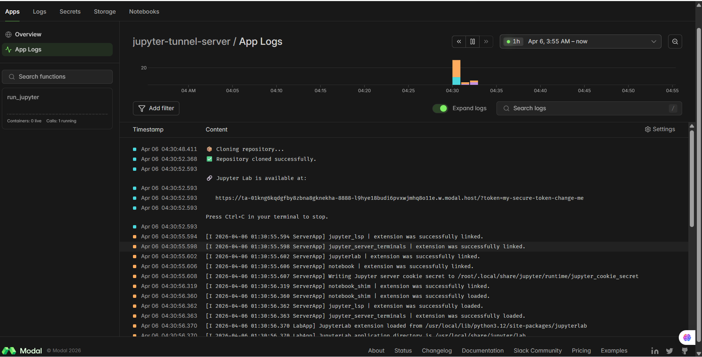

# 🚀 Modal Jupyter Setup (CPU by default)

This module launches a **Jupyter Lab environment on Modal** using a tunnel approach. The script `jupyter_tunnel.py` runs Jupyter Lab inside a Modal container and creates a secure public URL forwarded to your browser.

This repository includes `run_jupyter_server/jupyter_tunnel.py` which:

- Clones a repo (using a GitHub token secret)
- Starts Jupyter Lab inside the container
- Forwards a public Modal URL with a token to your terminal/logs

---

**Important:** This script requests CPU resources only (no GPU). By default Modal functions without a `gpu` argument will run on CPU. To request a GPU, add or uncomment `gpu="any"` in the `@app.function(...)` decorator in `jupyter_tunnel.py`.

## 📁 File

```
run_jupyter_server/jupyter_tunnel.py
```

---

## ⚙️ What It Does

- Spins up a remote Jupyter Lab instance
- Runs inside a containerized environment
- Installs core data science dependencies (via the container image): pandas, numpy, pyarrow, plotly, scikit-learn, hdbscan, etc.
- Serves Jupyter via a **public Modal URL** using `modal.forward()`
- Runs for up to **24 hours** by default

---

## 🧰 Prerequisites (local)

1. Python 3.9+
2. Create a virtual environment (recommended) and install the Modal CLI client:

```bash
python -m venv .venv
source .venv/bin/activate   # or `.venv\\Scripts\\activate` on Windows
pip install --upgrade pip
pip install modal
```

3. Authenticate the Modal CLI with your token (replace placeholders):

```bash
modal token set --token-id <TOKEN_ID> --token-secret <TOKEN_SECRET>
```

- Modal docs for `modal token set`: https://modal.com/docs/reference/cli/token#modal-token-set
- Generate/manage tokens on Modal: https://modal.com/settings/<USERNAME>/tokens

> Note: After running `modal token set` the CLI is authenticated and you can run `modal run` / `modal serve` commands.

---

## 🚀 Run (CPU — default)

This script does not request a GPU, so running it will schedule a CPU container. To start the Jupyter server from this repo:

```bash
cd run_jupyter_server
modal run jupyter_tunnel.py
```

Check the logs (Modal web UI or terminal) — the script prints a forwarded URL like:

```
https://<modal-url>/?token=my-secure-token-change-me
```

Open that URL in your browser to access Jupyter Lab.

---

## 🔐 Private Repo Access (Optional)

To clone a private GitHub repository inside the container, create a Modal secret with your GitHub token and reference it in `jupyter_tunnel.py`:

```bash
modal secret create github-token GITHUB_TOKEN=your_token_here
```
> **Note:** make sure to run it before you run `modal run jupyter_tunnel.py` since this should set the token in [Modal Secret](https://modal.com/secrets/joshua-abok/main)

Then `jupyter_tunnel.py` uses `@app.function(secrets=[modal.Secret.from_name("github-token")])` to access it.

---

## ⚡ GPU Support (Optional)

If you require GPU, edit `run_jupyter_server/jupyter_tunnel.py` and modify the `@app.function` decorator to request GPU resources, for example:

```python
@app.function(
    image=image,
    gpu="any",  # or "A10G", "T4"
    timeout=60*60*24,
)
def run_jupyter(...):
    ...
```

Uncomment or add the `gpu` argument, then run `modal run jupyter_tunnel.py`. Note that GPU instances may take longer to schedule and incur GPU-specific billing.

---


# 🔄 Redeploy (Update Code)

Whenever you make changes:

```bash
modal serve modaL_jupyter.py
```

👉 This automatically:

* rebuilds the environment (if needed)
* updates your running app
* replaces the previous version

## 🧠 Notes & Troubleshooting

- The script prints the forwarded Modal URL in the logs — open it with the token printed there.
- If you see permission or clone errors, verify the `GITHUB_TOKEN` secret and repository URL.
- No manual restart needed
  >Modal handles container lifecycle

  >Old instances shut down automatically

- The attached screenshot (in the project resources) shows a successful run where the app logs include the forwarded URL and Jupyter extensions loading.

 > Here’s an example of modal interface when running the file `jupyter_tunnel.py`:


---

## ✔️ Quick Checklist

- **Install Modal CLI:** `pip install modal`
- **Set token:** `modal token set --token-id <ID> --token-secret <SECRET>`
- **Run (CPU):** `modal run jupyter_tunnel.py`
- **Optional GPU:** add `gpu="any"` to the `@app.function` decorator


